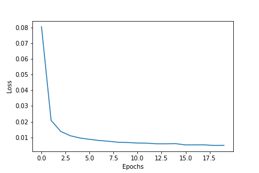
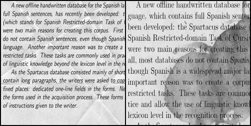
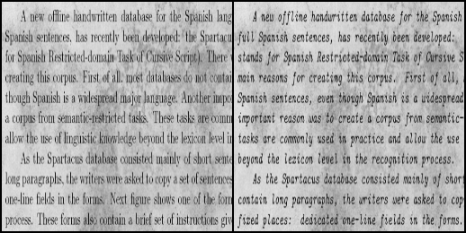

# AutoEncoder

## Integrantes

| Nombre y Apellidos | Código de alumno |
|-|-|
|Jorge Luis Vásquez | 201310292 |
|Jose Adrian Porres	| 201910265 |

## Red

- BachtNorm : Sirve para que en el proceso de entrenamiento se normalice el input en cada una de las capas, de esta forma cada batch está normalizado y evita que surja el problema conocido como "Internal covariate shift", cuando los inputs cambian de distribución las capas ocultas intentan adaptarse a esa nueva distribución haciendo que ese proceso sea mucho más lento en la etapa del entrenamiento.

# Resultados

## Loss Function

## 4 Mejores Resultados

### Imagen 1

### Imagen 2

### Imagen 3

### Imagen 4

